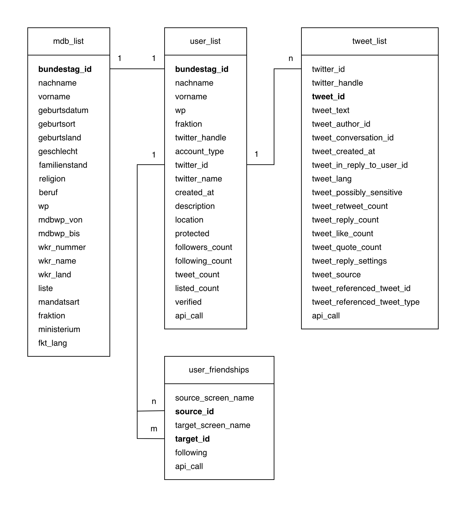

# Content-Sharing
Analyzing Twitter data of the 20th German Parliament (also known as "Bundestag") to identify patterns in retweeting behavior.

## data

The most important tables (stored as csv-files in the <code>data</code>-folder) are <code>mdb_list</code>, <code>user_list</code>, <code>tweet_list</code> and <code>user_friendships</code>.

* <code>mdb_list</code> contains all politicians that are/were part of the 20th German Parliament.
* <code>user_list</code> contains all politicians that have a Twitter account (even if the profile is not actively used). The additional account information was downloaded via the Twitter API. In the column <i>api_call</i> the time when the request was made is logged. 
* <code>tweet_list</code> contains the max. 3200 latest tweets by a user. This includes also retweets, quotes and replies. For a better scraping experience, the tweets of each user were stored in individual files. To work with all tweets, the files can be merged together into one table. 
* <code>user_friendships</code> contains all "friendships" between the users. As Twitter allows uni-directional und bi-directional "friendships", two users always appear twice in the list (e.g. X;Y;TRUE and Y;X;FALSE means the "friendship" is uni-directional).

## data-collection 

This folder contains all scripts for the data collection and transformation. The <code>config.py</code> script is needed to load the environment variables to be able to access the Twitter API. The files are listed in the order they need to be executed. Otherwise the output-files may contain errors.

### Working with Twitter API

* Create a Twitter account and get access to the API v2 and v1.1
* Create a <code>.env</code> file in the root directory with the keys <code>API_KEY</code>, <code>API_SECRET_KEY</code>, <code>ACCESS_TOKEN</code>, <code>ACCESS_SECRET</code> and <code>BEARER_TOKEN</code>
* Run the script <code>config.py</code> to load the environment variables from the <code>.env</code> file

### Preprocessing
* <code>mdb_collection</code>: Reads the XML file which was downloaded from the Bundestag website and transforms it into a table of politicians that were/are part of the 20th German Parliament. The results are stored in <code>mdb_list.csv</code>
* <code>mdb_twitter_collection.py</code>: Loads the information about the Twitter usernames of the politicians from <code>twitter_usernames.csv</code> and appends it to the results of <code>mdb_list.csv</code>. They are joined via the <i>bundestag_id</i>. The result is stored in <code>mdb_twitter_list.csv</code>

### Accessing Twitter API
* <code>user_collection.py</code>: Reads <code>mdb_twitter_list.csv</code> and enriches the table with the Twitter profile information. The API is accessed via the <i>twitter_handle</i> (Twitter username). The results are stored in <code>user_list.csv</code> and only contain entries of politicians with a Twitter account
* <code>tweet_collection.py</code>: Reads <code>user_list.csv</code> to get the <i>twitter_id</i>'s of the accounts and then checks in the folder <code>tweet_list</code> if the tweets of the specific account were already downloaded. If not, it downloads the last 3200 tweets of the account in one file and stores it in the format <code>tweet_list_TWITTER_ID_TWITTER_HANDLE.csv</code>
* <code>user_friendship_collection.py</code>: Reads the files <code>user_list.csv</code> and <code>user_friendships.csv</code>. Then it goes through the account list and checks if the friendship between two users was already checked. Friendship means if the two users follow each other or only one account follows the other account. If the friendship was not checked before, it calls the API and stores the result directly in <code>user_friendships.csv</code>

### Transformations
* <code>retweeter_collection.py</code>: Checks all tweet-files in the folder <code>tweet_list</code> and finds out which retweets/quotes are related to tweets in this list of tweets. In other words, it finds out which politician quoted/retweeted a tweet of another politician. The results are then stored in <code>retweet_list.csv</code> and <code>quote_list.csv</code>. Users can retweet/quote their own tweets as well

## data-analysis

TODO
